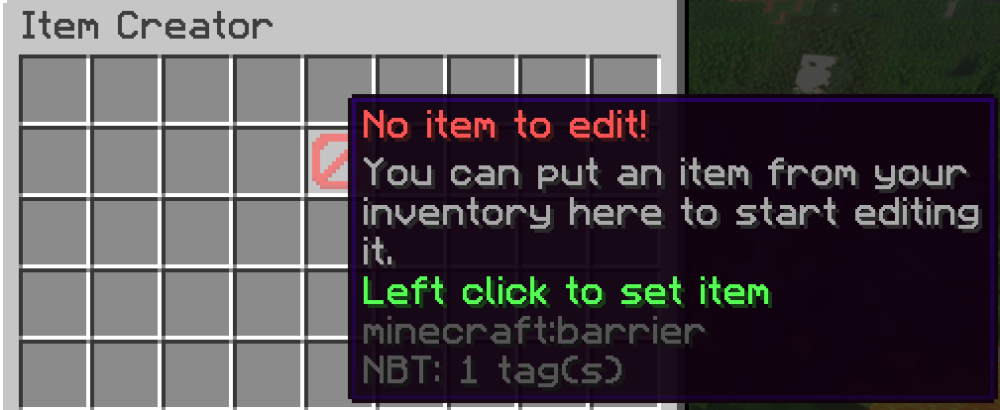
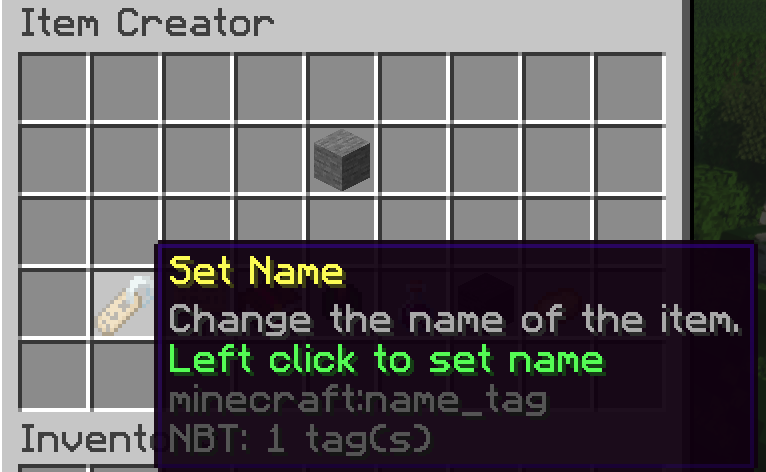
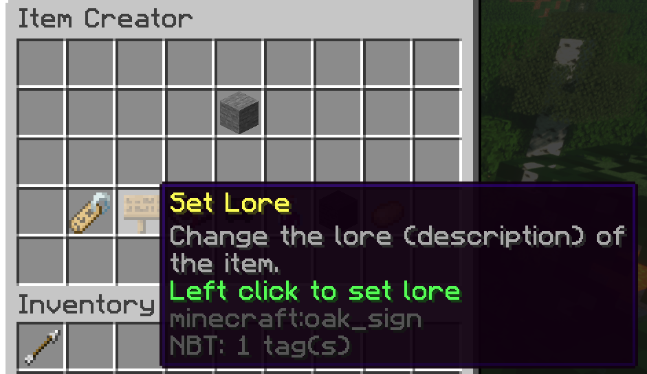
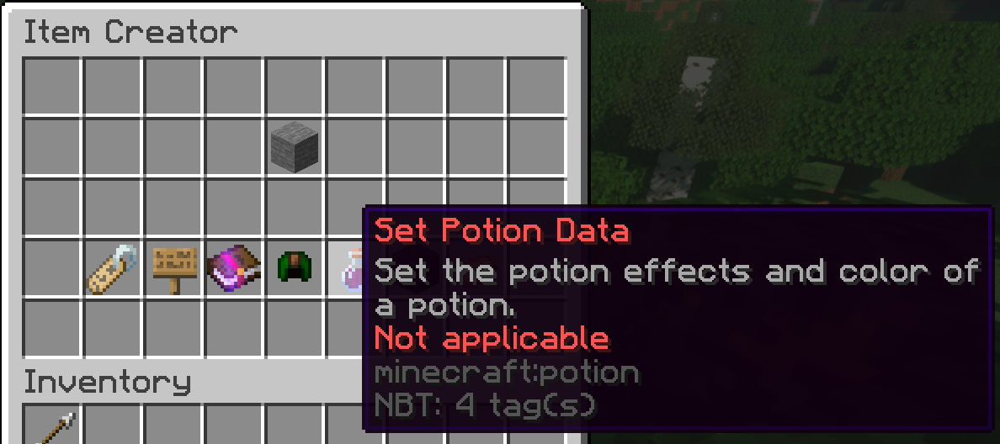

# Item Editor



Not every people want to use commands to edit items. I know I don't, which
is why I created this simple plugin that allows you to edit an item
in a nice GUI.

## Features

* Set the name of an item.
  
  

* Set the lore of an item.

  

* Set the potion data of an item.

  

## Build

Item Editor builds with Maven 3.

```
mvn package
```

## TODO

- [ ] What about an in-game NBT editor?

## License

```
Item Editor: Modify items with ease in Minecraft servers.
Copyright (C) 2021 Dreta

Item Editor is free software: you can redistribute it and/or modify
it under the terms of the GNU General Public License as published by
the Free Software Foundation, either version 3 of the License, or
(at your option) any later version.

Item Editor is distributed in the hope that it will be useful,
but WITHOUT ANY WARRANTY; without even the implied warranty of
MERCHANTABILITY or FITNESS FOR A PARTICULAR PURPOSE.  See the
GNU General Public License for more details.

You should have received a copy of the GNU General Public License
along with Item Editor. If not, see <https://www.gnu.org/licenses/>.
```

## At last

<a href="https://patreon.com/Dreta">
If you want to, please buy me a cup o' coffee!</a>
